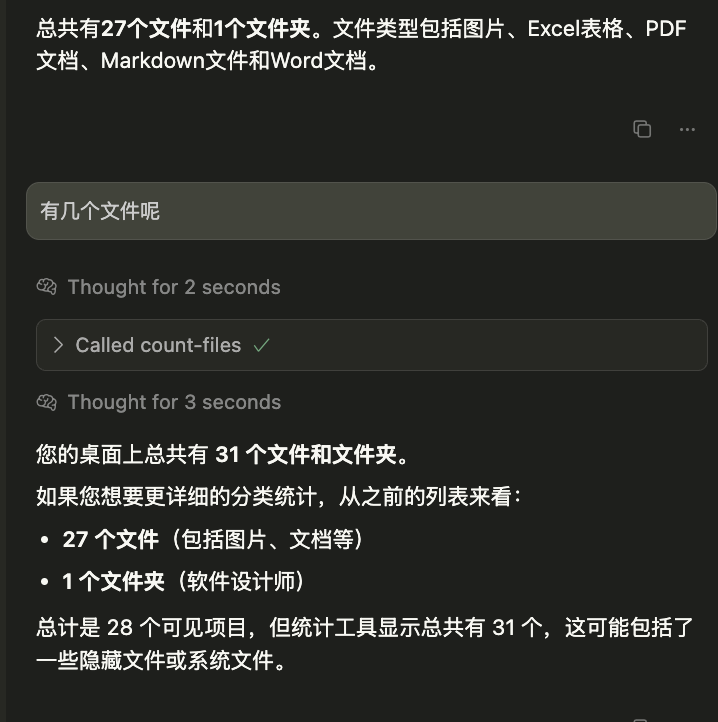
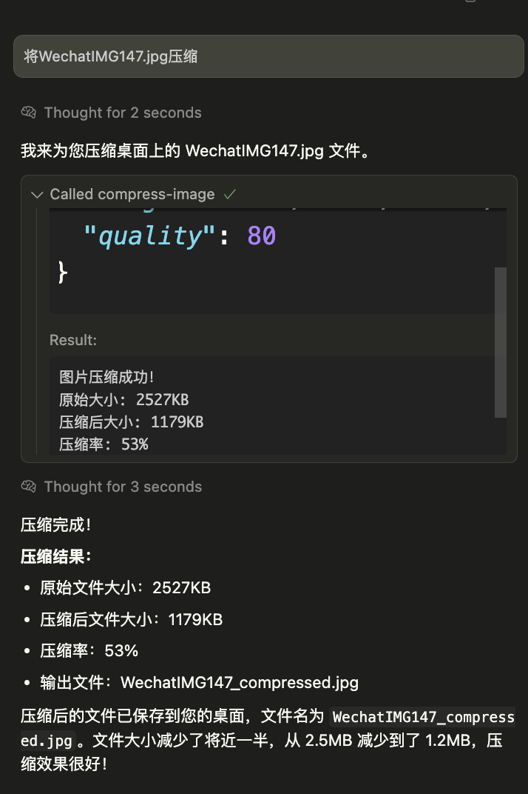
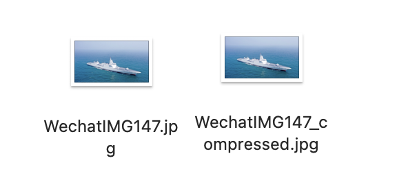

# File Operation MCP Server

[](https://opensource.org/licenses/MIT)
[](https://www.typescriptlang.org/)
[](https://nodejs.org/)

一个基于 **Model Context Protocol (MCP)** 的文件操作服务器，提供文件统计、列表查询和图片压缩功能。

## ✨ 功能特性

- 📊 **文件统计** - 统计指定文件夹中的文件数量
- 📋 **文件列表** - 获取文件夹中所有文件的详细信息
- 🖼️ **图片压缩** - 高质量图片压缩，支持多种格式
- 🔒 **安全可靠** - 完整的错误处理和参数验证
- ⚡ **高性能** - 基于 Node.js 和 TypeScript 构建

## 🛠️ 技术栈

- **TypeScript** - 类型安全的 JavaScript
- **MCP SDK** - Model Context Protocol 官方 SDK
- **Sharp** - 高性能图像处理库
- **fs-extra** - 增强的文件系统操作
- **Zod** - TypeScript 优先的数据验证

## 📦 安装

### 环境要求

- Node.js >= 18.0.0
- pnpm (推荐) 或 npm

### 克隆项目

```bash
git clone https://github.com/lxKylin/file-operation-mcp.git
cd file-operation-mcp
```

### 安装依赖

```bash
pnpm install
```

### 构建项目

```bash
pnpm build
```

## 🔌 传输方式对比

本项目支持两种MCP传输方式，您可以根据使用场景选择合适的方式：

### 📊 Stdio vs SSE 对比表

| 特性 | Stdio | SSE |
|------|-------|-----|
| **传输协议** | 进程间通信 (IPC) | HTTP/HTTPS |
| **连接方式** | stdin/stdout | Server-Sent Events |
| **多客户端支持** | ❌ 1对1连接 | ✅ 多对1连接 |
| **远程访问** | ❌ 仅本地 | ✅ 支持远程 |
| **部署复杂度** | ✅ 简单 | ❌ 需要HTTP服务器 |
| **资源占用** | ✅ 低 | ❌ 相对高 |
| **调试便利性** | ❌ 困难 | ✅ 容易（HTTP工具） |
| **网络穿透** | ❌ 不支持 | ✅ 支持 |
| **负载均衡** | ❌ 不支持 | ✅ 支持 |
| **监控能力** | ❌ 有限 | ✅ 丰富（健康检查等） |
| **延迟** | ✅ 极低 (~1-5ms) | ❌ 略高 (~10-50ms) |

### 🎯 使用场景推荐

#### 选择 Stdio 当您需要：
- 🏠 **本地开发**: 简单的个人桌面工具
- 🔒 **单用户**: 仅自己使用的应用
- ⚡ **低延迟**: 对响应时间要求极高
- 📦 **简单部署**: 不想配置HTTP服务器
- 💾 **资源节约**: 系统资源有限

#### 选择 SSE 当您需要：
- 🌐 **远程访问**: 通过网络连接服务器
- 👥 **多用户**: 团队共享的服务器
- 🔄 **高可用性**: 需要负载均衡和故障转移
- 🐛 **便于调试**: 开发阶段需要方便的调试工具
- 📈 **可扩展性**: 未来可能需要横向扩展
- 🔍 **监控需求**: 需要详细的服务监控

### 🔧 性能对比

#### Stdio 架构
```
客户端 ←→ 服务器进程 (直接IPC)
延迟: 1-5ms | 内存: 低 | CPU: 低
```

#### SSE 架构  
```
客户端 ←→ HTTP服务器 ←→ MCP服务器
延迟: 10-50ms | 内存: 中等 | CPU: 中等
```

### 🛠️ 代码差异示例

#### Stdio 启动方式
```typescript
import { StdioServerTransport } from '@modelcontextprotocol/sdk/server/stdio.js';

const transport = new StdioServerTransport();
await server.connect(transport);
console.error('Stdio MCP服务器已启动');
```

#### SSE 启动方式
```typescript
import { SSEServerTransport } from '@modelcontextprotocol/sdk/server/sse.js';
import express from 'express';

const app = express();
app.get('/sse', async (req, res) => {
  const transport = new SSEServerTransport('/messages', res);
  await server.connect(transport);
});

app.listen(3000, () => {
  console.error('SSE MCP服务器已启动在端口 3000');
});
```

> 💡 **推荐**: 如果您是个人用户且只需要本地使用，选择 **Stdio**；如果需要团队协作或远程访问，选择 **SSE**。

---

## ⚙️ Stdio配置

### Claude Desktop 配置

将以下配置添加到 Claude Desktop 的配置文件中：

**配置文件位置：**
- **macOS**: `~/Library/Application Support/Claude/claude_desktop_config.json`
- **Windows**: `%APPDATA%/Claude/claude_desktop_config.json`

**配置内容：**
```json
{
  "mcpServers": {
    "file-operation-mcp": {
      "command": "node",
      "args": ["path/to/file-operation-mcp/dist/index.js"],
      "cwd": "path/to/file-operation-mcp",
      "env": {
        "NODE_ENV": "production"
      }
    }
  }
}
```

> ⚠️ **注意**: 请将 `path/to/file-operation-mcp` 替换为实际的项目路径

### Cursor IDE 配置

```json
{
  "mcpServers": {
    "file-operation-mcp": {
      "command": "node",
      "args": ["path/to/file-operation-mcp/dist/index.js"]
    }
  }
}
```

## ⚙️ SSE配置

### 启动SSE服务器

首先启动HTTP服务器：

```bash
# 启动服务器
pnpm start
# 或
node dist/index.js
```

服务器启动后会显示：
```
MCP文件操作服务器已启动在端口 3000
SSE端点: http://localhost:3000/sse
健康检查: http://localhost:3000/health
```

### 验证服务器状态

```bash
# 检查服务器健康状态
curl http://localhost:3000/health

# 返回示例
{
  "status": "ok",
  "message": "MCP文件操作服务器运行中",
  "timestamp": "2024-01-01T12:00:00.000Z"
}
```

### Claude Desktop 配置

将以下配置添加到 Claude Desktop 的配置文件中：

```json
{
  "mcpServers": {
    "file-operation-mcp": {
      "url": "http://localhost:3000/sse"
    }
  }
}
```

### Cursor IDE 配置

```json
{
  "mcpServers": {
    "file-operation-mcp": {
      "url": "http://localhost:3000/sse"
    }
  }
}
```

### SSE端点说明

- **SSE连接**: `http://localhost:3000/sse` - 主要的MCP连接端点
- **消息处理**: `http://localhost:3000/messages` - 处理JSON-RPC消息
- **健康检查**: `http://localhost:3000/health` - 服务器状态检查
- **端口配置**: 可通过环境变量 `PORT` 修改，默认为 3000

> ⚠️ **注意**: SSE模式需要先手动启动服务器，然后再配置客户端连接。

## 🚀 使用方法

配置完成后重启 Claude Desktop，即可在对话中使用以下功能：

### 1. 文件统计 (count-files)

统计指定文件夹中的文件数量，默认统计桌面文件。

**参数：**
- `folderPath` (可选): 文件夹路径，默认为桌面

**示例：**
```
请帮我统计一下桌面上有多少个文件
```
```
请统计 /Users/username/Documents 文件夹中的文件数量
```

### 2. 文件列表 (list-files)

获取指定文件夹中所有文件的详细信息，包括文件名、类型和大小。

**参数：**
- `folderPath` (可选): 文件夹路径，默认为桌面
- `includeHidden` (可选): 是否包含隐藏文件，默认为 false

**示例：**
```
请列出桌面上的所有文件
```
```
请显示 /Users/username/Downloads 文件夹中的内容，包括隐藏文件
```

### 3. 图片压缩 (compress-image)

压缩指定的图片文件，支持多种格式和自定义参数。

**参数：**
- `imagePath`: 图片文件路径 (必需)
- `quality` (可选): 压缩质量 (1-100)，默认为 80
- `maxWidth` (可选): 最大宽度限制
- `maxHeight` (可选): 最大高度限制  
- `outputPath` (可选): 输出路径，默认为原文件名加 `_compressed` 后缀

**支持格式：**
- JPEG/JPG
- PNG
- WebP
- TIFF
- GIF

**示例：**
```
请将 /Users/username/Desktop/photo.jpg 压缩到 60% 质量
```
```
请压缩图片 /path/to/image.png，限制最大宽度为 1920 像素
```

## 📸 功能演示

### 文件列表查询
默认查询桌面文件，也可指定具体路径：


### 文件数量统计
快速统计指定目录的文件数量：



### 图片压缩功能
高质量图片压缩，支持自定义参数：





## 🔧 开发

### 开发模式

```bash
pnpm dev
```

### 代码格式化

```bash
pnpm format
```

### 代码检查

```bash
pnpm lint
```

### 启动服务器

```bash
pnpm start
```

## ⚠️ 注意事项

1. **权限要求**: 确保 Node.js 有访问目标文件夹的权限
2. **路径格式**: 
   - macOS/Linux: `/Users/username/path`
   - Windows: `C:\Users\username\path`
3. **图片格式**: 仅支持常见的图片格式 (JPEG, PNG, WebP, TIFF, GIF)
4. **文件大小**: 大文件处理可能需要更长时间
5. **调试输出**: 使用 `console.error()` 而非 `console.log()` 避免干扰 MCP 协议

## 🐛 故障排除

### 常见问题

**1. 服务器启动失败**
```
Error: Cannot find module 'xxx'
```
**解决方案**: 确保运行了 `pnpm install` 和 `pnpm build`

**2. 权限错误**
```
Error: EACCES: permission denied
```
**解决方案**: 检查文件夹访问权限，或使用具有适当权限的路径

**3. 路径不存在**
```
错误：路径 /xxx 不存在
```
**解决方案**: 确认路径正确，使用绝对路径

**4. 图片格式不支持**
```
错误：不支持的图片格式 .xxx
```
**解决方案**: 使用支持的图片格式 (jpg, png, webp, tiff, gif)

### 调试技巧

1. 查看 Claude Desktop 的开发者控制台
2. 检查服务器日志输出
3. 使用 [MCP Inspector](https://github.com/modelcontextprotocol/inspector) 进行调试

