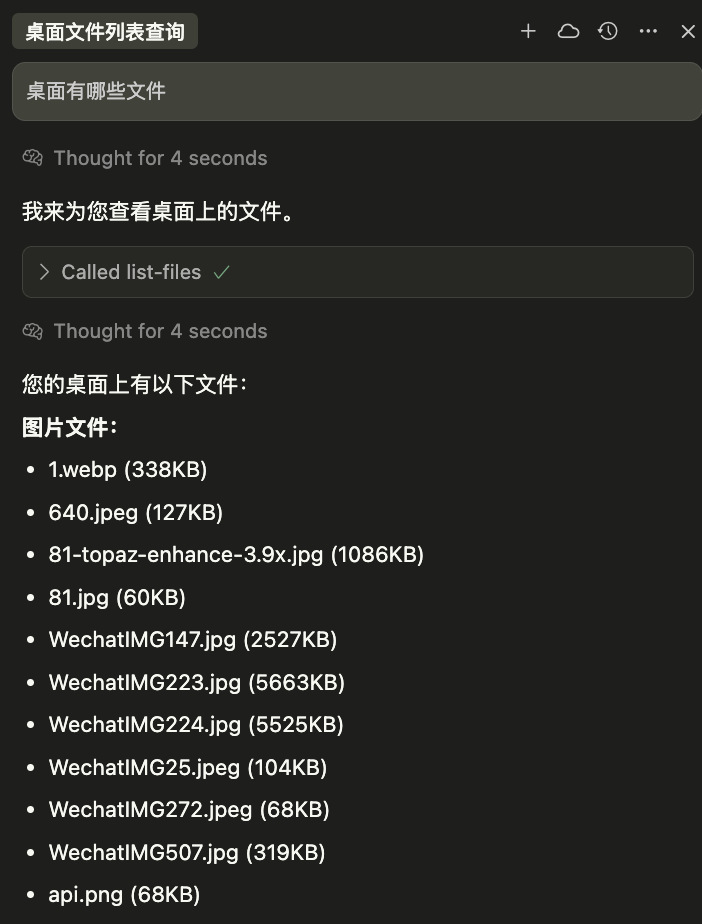

# File Operation MCP Server

[](https://opensource.org/licenses/MIT)
[](https://www.typescriptlang.org/)
[](https://nodejs.org/)

一个基于 **Model Context Protocol (MCP)** 的文件操作服务器，提供文件统计、列表查询和图片压缩功能。

## ✨ 功能特性

- 📊 **文件统计** - 统计指定文件夹中的文件数量
- 📋 **文件列表** - 获取文件夹中所有文件的详细信息
- 🖼️ **图片压缩** - 高质量图片压缩，支持多种格式
- 🗜️ **文件压缩** - 创建ZIP、TAR、TAR.GZ格式的压缩文件
- 📦 **文件解压** - 解压ZIP、TAR、TAR.GZ格式的压缩文件
- 📂 **文件复制** - 复制文件或文件夹到指定位置
- 🔄 **文件移动** - 移动文件或文件夹到指定位置
- 📄 **PDF合并** - 将多个PDF文件合并成一个
- ✂️ **PDF拆分** - 将PDF文件按页面或范围拆分
- 🖼️ **PDF转图片** - 将PDF页面转换为JPEG/PNG图片
- 🔒 **安全可靠** - 完整的错误处理和参数验证
- ⚡ **高性能** - 基于 Node.js 和 TypeScript 构建

## 🛠️ 技术栈

- **TypeScript** - 类型安全的 JavaScript
- **MCP SDK** - Model Context Protocol 官方 SDK
- **Sharp** - 高性能图像处理库
- **PDF-lib** - 纯JavaScript PDF处理库，支持合并拆分
- **PDF2pic** - PDF转图片转换工具
- **Mammoth** - Word文档处理库
- **Puppeteer** - 无头浏览器，用于PDF生成
- **Archiver** - 文件压缩库，支持ZIP、TAR等格式
- **Extract-Zip** - ZIP文件解压库
- **TAR** - TAR格式文件处理库
- **fs-extra** - 增强的文件系统操作
- **Zod** - TypeScript 优先的数据验证

## 📦 安装

### 环境要求

- Node.js >= 18.0.0
- pnpm (推荐) 或 npm

### 克隆项目

```bash
git clone https://github.com/lxKylin/file-operation-mcp.git
cd file-operation-mcp
```

### 安装依赖

```bash
pnpm install
```

### 构建项目

```bash
pnpm build
```

## 🔌 传输方式对比

本项目支持两种MCP传输方式，您可以根据使用场景选择合适的方式：

### 📊 Stdio vs SSE 对比表

| 特性 | Stdio | SSE |
|------|-------|-----|
| **传输协议** | 进程间通信 (IPC) | HTTP/HTTPS |
| **连接方式** | stdin/stdout | Server-Sent Events |
| **多客户端支持** | ❌ 1对1连接 | ✅ 多对1连接 |
| **远程访问** | ❌ 仅本地 | ✅ 支持远程 |
| **部署复杂度** | ✅ 简单 | ❌ 需要HTTP服务器 |
| **资源占用** | ✅ 低 | ❌ 相对高 |
| **调试便利性** | ❌ 困难 | ✅ 容易（HTTP工具） |
| **网络穿透** | ❌ 不支持 | ✅ 支持 |
| **负载均衡** | ❌ 不支持 | ✅ 支持 |
| **监控能力** | ❌ 有限 | ✅ 丰富（健康检查等） |
| **延迟** | ✅ 极低 (~1-5ms) | ❌ 略高 (~10-50ms) |

### 🎯 使用场景推荐

#### 选择 Stdio 当您需要：
- 🏠 **本地开发**: 简单的个人桌面工具
- 🔒 **单用户**: 仅自己使用的应用
- ⚡ **低延迟**: 对响应时间要求极高
- 📦 **简单部署**: 不想配置HTTP服务器
- 💾 **资源节约**: 系统资源有限

#### 选择 SSE 当您需要：
- 🌐 **远程访问**: 通过网络连接服务器
- 👥 **多用户**: 团队共享的服务器
- 🔄 **高可用性**: 需要负载均衡和故障转移
- 🐛 **便于调试**: 开发阶段需要方便的调试工具
- 📈 **可扩展性**: 未来可能需要横向扩展
- 🔍 **监控需求**: 需要详细的服务监控

### 🔧 性能对比

#### Stdio 架构
```
客户端 ←→ 服务器进程 (直接IPC)
延迟: 1-5ms | 内存: 低 | CPU: 低
```

#### SSE 架构  
```
客户端 ←→ HTTP服务器 ←→ MCP服务器
延迟: 10-50ms | 内存: 中等 | CPU: 中等
```

### 🛠️ 代码差异示例

#### Stdio 启动方式
```typescript
import { StdioServerTransport } from '@modelcontextprotocol/sdk/server/stdio.js';

const transport = new StdioServerTransport();
await server.connect(transport);
console.error('Stdio MCP服务器已启动');
```

#### SSE 启动方式
```typescript
import { SSEServerTransport } from '@modelcontextprotocol/sdk/server/sse.js';
import express from 'express';

const app = express();
app.get('/sse', async (req, res) => {
  const transport = new SSEServerTransport('/messages', res);
  await server.connect(transport);
});

app.listen(3000, () => {
  console.error('SSE MCP服务器已启动在端口 3000');
});
```

> 💡 **推荐**: 如果您是个人用户且只需要本地使用，选择 **Stdio**；如果需要团队协作或远程访问，选择 **SSE**。

---

## ⚙️ Stdio配置

### Claude Desktop 配置

将以下配置添加到 Claude Desktop 的配置文件中：

**配置文件位置：**
- **macOS**: `~/Library/Application Support/Claude/claude_desktop_config.json`
- **Windows**: `%APPDATA%/Claude/claude_desktop_config.json`

**配置内容：**
```json
{
  "mcpServers": {
    "file-operation-mcp": {
      "command": "node",
      "args": ["path/to/file-operation-mcp/dist/index.js"],
      "cwd": "path/to/file-operation-mcp",
      "env": {
        "NODE_ENV": "production"
      }
    }
  }
}
```

> ⚠️ **注意**: 请将 `path/to/file-operation-mcp` 替换为实际的项目路径

### Cursor IDE 配置

```json
{
  "mcpServers": {
    "file-operation-mcp": {
      "command": "node",
      "args": ["path/to/file-operation-mcp/dist/index.js"]
    }
  }
}
```

## ⚙️ SSE配置

### 启动SSE服务器

首先启动HTTP服务器：

```bash
# 启动服务器
pnpm start
# 或
node dist/index.js
```

服务器启动后会显示：
```
MCP文件操作服务器已启动在端口 3000
SSE端点: http://localhost:3000/sse
健康检查: http://localhost:3000/health
```

### 验证服务器状态

```bash
# 检查服务器健康状态
curl http://localhost:3000/health

# 返回示例
{
  "status": "ok",
  "message": "MCP文件操作服务器运行中",
  "timestamp": "2024-01-01T12:00:00.000Z"
}
```

### Claude Desktop 配置

将以下配置添加到 Claude Desktop 的配置文件中：

```json
{
  "mcpServers": {
    "file-operation-mcp": {
      "url": "http://localhost:3000/sse"
    }
  }
}
```

### Cursor IDE 配置

```json
{
  "mcpServers": {
    "file-operation-mcp": {
      "url": "http://localhost:3000/sse"
    }
  }
}
```

### SSE端点说明

- **SSE连接**: `http://localhost:3000/sse` - 主要的MCP连接端点
- **消息处理**: `http://localhost:3000/messages` - 处理JSON-RPC消息
- **健康检查**: `http://localhost:3000/health` - 服务器状态检查
- **端口配置**: 可通过环境变量 `PORT` 修改，默认为 3000

> ⚠️ **注意**: SSE模式需要先手动启动服务器，然后再配置客户端连接。

## 🚀 使用方法

配置完成后重启 Claude Desktop，即可在对话中使用以下功能：

### 1. 文件统计 (count-files)

统计指定文件夹中的文件数量，默认统计桌面文件。

**参数：**
- `folderPath` (可选): 文件夹路径，默认为桌面

**示例：**
```
请帮我统计一下桌面上有多少个文件
```
```
请统计 /Users/username/Documents 文件夹中的文件数量
```

### 2. 文件列表 (list-files)

获取指定文件夹中所有文件的详细信息，包括文件名、类型和大小。

**参数：**
- `folderPath` (可选): 文件夹路径，默认为桌面
- `includeHidden` (可选): 是否包含隐藏文件，默认为 false

**示例：**
```
请列出桌面上的所有文件
```
```
请显示 /Users/username/Downloads 文件夹中的内容，包括隐藏文件
```

### 3. 图片压缩 (compress-image)

压缩指定的图片文件，支持多种格式和自定义参数。

**参数：**
- `imagePath`: 图片文件路径 (必需)
- `quality` (可选): 压缩质量 (1-100)，默认为 80
- `maxWidth` (可选): 最大宽度限制
- `maxHeight` (可选): 最大高度限制  
- `outputPath` (可选): 输出路径，默认为原文件名加 `_compressed` 后缀

**支持格式：**
- JPEG/JPG
- PNG
- WebP
- TIFF
- GIF

**示例：**
```
请将 /Users/username/Desktop/photo.jpg 压缩到 60% 质量
```
```
请压缩图片 /path/to/image.png，限制最大宽度为 1920 像素
```

### 4. 文件压缩 (create-archive)

将文件或文件夹压缩为ZIP、TAR或TAR.GZ格式。

**参数：**
- `files`: 要压缩的文件/文件夹路径数组 (必需)
- `outputPath`: 输出压缩文件路径 (必需)
- `format` (可选): 压缩格式 (zip, tar, tar.gz)，默认为zip
- `compressionLevel` (可选): 压缩级别 (0-9)，默认为6

**支持格式：**
- **ZIP** - 通用压缩格式，兼容性最好
- **TAR** - Unix/Linux常用格式，无压缩
- **TAR.GZ** - TAR格式+GZIP压缩，压缩率高

**示例：**
```
请将 /Users/username/Documents 文件夹压缩为ZIP格式
```
```
请压缩文件 ["/path/file1.txt", "/path/file2.txt"] 为 /backup/files.tar.gz 格式
```
```
请将项目文件夹压缩为高压缩级别的ZIP包
```

### 5. 文件解压 (extract-archive)

解压ZIP、TAR或TAR.GZ文件到指定目录。

**参数：**
- `archivePath`: 压缩文件路径 (必需)
- `extractTo`: 解压目标目录 (必需)
- `overwrite` (可选): 是否覆盖已存在文件，默认为false

**支持格式：**
- **ZIP** - .zip文件
- **TAR** - .tar文件
- **TAR.GZ** - .tar.gz、.tgz文件

**示例：**
```
请解压 /Downloads/archive.zip 到 /Projects/ 目录
```
```
请解压 /backup/files.tar.gz 到 /restore/ 并覆盖现有文件
```
```
请将压缩包解压到临时文件夹
```

**注意事项：**
- 解压前会检查目标目录是否为空（除非设置overwrite=true）
- 支持自动检测压缩格式
- 会显示解压文件数量和总大小
- 解压过程中会保持原始文件结构

### 6. 文件复制 (copy-files)

复制文件或文件夹到指定位置，保持原文件不变。

**参数：**
- `sourcePath`: 源文件/文件夹路径 (必需)
- `targetPath`: 目标路径 (必需)
- `overwrite` (可选): 是否覆盖已存在文件，默认为false
- `preserveTimestamps` (可选): 是否保留时间戳，默认为true

**特性：**
- 支持文件和文件夹复制
- 递归复制整个目录结构
- 可选择保留原始时间戳
- 安全检查防止意外覆盖
- 显示复制详情和文件统计

**示例：**
```
请复制 /Users/username/Documents/report.pdf 到 /backup/ 目录
```
```
请复制整个项目文件夹到备份目录，保留时间戳
```
```
请复制文件并覆盖已存在的目标文件
```

### 7. 文件移动 (move-files)

移动文件或文件夹到指定位置，相当于剪切操作。

**参数：**
- `sourcePath`: 源文件/文件夹路径 (必需)
- `targetPath`: 目标路径 (必需)
- `overwrite` (可选): 是否覆盖已存在文件，默认为false

**特性：**
- 支持文件和文件夹移动
- 原子操作，确保数据安全
- 自动验证移动完成
- 防止源路径和目标路径相同
- 跨文件系统移动支持

**示例：**
```
请移动 /Downloads/archive.zip 到 /Projects/ 目录
```
```
请将临时文件夹移动到永久存储位置
```
```
请移动文件并覆盖目标位置的同名文件
```

**注意事项：**
- 移动操作会删除原始文件/文件夹
- 支持跨分区/驱动器移动
- 移动前会验证目标目录权限
- 操作完成后会验证结果

### 8. PDF合并 (merge-pdf)

将多个PDF文件合并成一个完整的PDF文档。

**参数：**
- `inputPaths`: PDF文件路径数组 (必需)
- `outputPath`: 输出PDF文件路径 (必需)
- `title` (可选): 合并后PDF的标题

**特性：**
- 支持合并任意数量的PDF文件
- 保持原始页面格式和质量
- 自动设置文档元数据
- 详细的合并统计报告
- 自动添加.pdf扩展名

**示例：**
```
请合并这些PDF文件：["/reports/report1.pdf", "/reports/report2.pdf"] 到 "/merged/combined_report.pdf"
```
```
请将项目文档合并，标题设为 "完整项目文档"
```

### 9. PDF拆分 (split-pdf)

将PDF文件拆分成多个独立的文件，支持按页面或自定义范围拆分。

**参数：**
- `inputPath`: 输入PDF文件路径 (必需)
- `outputDir`: 输出目录 (必需)
- `splitMode` (可选): 拆分模式 - `pages`(每页一个文件) 或 `ranges`(按范围拆分)，默认pages
- `ranges` (可选): 页面范围数组，如 ["1-3", "4-6"]，仅ranges模式需要
- `prefix` (可选): 输出文件名前缀，默认为原文件名

**特性：**
- 两种拆分模式：逐页拆分或范围拆分
- 灵活的页面范围设置
- 保持原始页面格式
- 自动文件命名和编号
- 详细的拆分统计

**示例：**
```
请将 "/documents/manual.pdf" 按页面拆分到 "/pages/" 目录
```
```
请将PDF按范围拆分：["1-5", "6-10", "11-15"]
```
```
请拆分PDF的第3页到第8页为单独文件
```
- 拆分前


- 拆分后


### 10. PDF转图片 (pdf-to-image)

将PDF页面转换为高质量的图片文件，支持多种格式和自定义设置。

**参数：**
- `inputPath`: 输入PDF文件路径 (必需)
- `outputDir`: 输出目录 (必需)
- `format` (可选): 图片格式 - `jpeg` 或 `png`，默认jpeg
- `quality` (可选): 图片质量 1-100，默认80
- `dpi` (可选): 分辨率DPI 50-600，默认150
- `pages` (可选): 页面范围，如 "1-3" 或 "1,3,5"，默认全部页面
- `prefix` (可选): 输出文件名前缀

**特性：**
- 支持JPEG和PNG格式
- 可调节图片质量和分辨率
- 灵活的页面选择（范围、列表、单页）
- 批量处理所有页面
- 详细的转换统计信息

**示例：**
```
请将 "/docs/presentation.pdf" 转换为PNG图片，分辨率300 DPI
```
```
请只转换PDF的第1、3、5页为JPEG图片
```
```
请将PDF第10-20页转换为高质量图片
```

**注意事项：**
- PDF转图片需要系统支持ImageMagick或GraphicsMagick
- 高分辨率设置会增加文件大小和处理时间
- PNG格式文件较大但质量更好
- 分辨率推荐：屏幕显示150 DPI，打印300 DPI

## 📸 功能演示

### 文件列表查询
默认查询桌面文件，也可指定具体路径：



### 文件数量统计
快速统计指定目录的文件数量：


### 图片压缩功能
高质量图片压缩，支持自定义参数：


## 🔧 开发

### 开发模式

```bash
pnpm dev
```

### 代码格式化

```bash
pnpm format
```

### 代码检查

```bash
pnpm lint
```

### 启动服务器

```bash
pnpm start
```

## ⚠️ 注意事项

1. **权限要求**: 确保 Node.js 有访问目标文件夹的权限
2. **路径格式**: 
   - macOS/Linux: `/Users/username/path`
   - Windows: `C:\Users\username\path`
3. **图片格式**: 仅支持常见的图片格式 (JPEG, PNG, WebP, TIFF, GIF)
4. **压缩格式**: 支持ZIP、TAR、TAR.GZ格式的压缩和解压
5. **文件操作**: 复制和移动操作支持文件和文件夹
6. **PDF处理**: PDF合并、拆分和转图片功能完全基于纯JavaScript
7. **图片转换**: PDF转图片需要系统支持ImageMagick或GraphicsMagick
8. **文件权限**: 确保对源文件和目标目录有相应权限
9. **覆盖保护**: 默认不覆盖已存在文件，需要明确设置
10. **文件大小**: 大文件处理可能需要更长时间
11. **调试输出**: 使用 `console.error()` 而非 `console.log()` 避免干扰 MCP 协议

## 🐛 故障排除

### 常见问题

**1. 服务器启动失败**
```
Error: Cannot find module 'xxx'
```
**解决方案**: 确保运行了 `pnpm install` 和 `pnpm build`

**2. 权限错误**
```
Error: EACCES: permission denied
```
**解决方案**: 检查文件夹访问权限，或使用具有适当权限的路径

**3. 路径不存在**
```
错误：路径 /xxx 不存在
```
**解决方案**: 确认路径正确，使用绝对路径

**4. 图片格式不支持**
```
错误：不支持的图片格式 .xxx
```
**解决方案**: 使用支持的图片格式 (jpg, png, webp, tiff, gif)

**5. 压缩文件创建失败**
```
错误：创建压缩文件时发生错误
```
**解决方案**: 
- 检查文件路径是否正确
- 确保对输出目录有写入权限
- 检查磁盘空间是否充足

**6. 解压文件失败**
```
错误：目标目录不为空
```
**解决方案**: 设置 `overwrite=true` 或清空目标目录

**7. 不支持的压缩格式**
```
错误：不支持的压缩格式
```
**解决方案**: 使用支持的格式 (.zip, .tar, .tar.gz, .tgz)

**8. 文件复制失败**
```
错误：目标路径已存在
```
**解决方案**: 设置 `overwrite=true` 或选择不同的目标路径

**9. 文件移动失败**
```
错误：源路径和目标路径不能相同
```
**解决方案**: 确保源路径和目标路径不同

**10. 权限不足**
```
Error: EACCES: permission denied
```
**解决方案**: 
- 检查源文件和目标目录的访问权限
- 确保有足够的磁盘空间
- 避免移动系统关键文件

**11. PDF文件损坏**
```
错误：无法处理PDF文件
```
**解决方案**: 
- 检查PDF文件是否完整且未损坏
- 确认PDF文件不是受密码保护的
- 尝试用其他PDF查看器验证文件

**12. PDF转图片失败**
```
错误：批量转换失败
```
**解决方案**: 
- 确保系统已安装ImageMagick或GraphicsMagick
- 检查系统PATH环境变量配置
- 降低DPI设置或减少页面数量

**13. 页面范围错误**
```
错误：页面范围超出有效范围
```
**解决方案**: 
- 检查PDF文件实际页数
- 确保页面范围格式正确（如 "1-5"、"1,3,5"）
- 页面编号从1开始，不是0

### 调试技巧

1. 查看 Claude Desktop 的开发者控制台
2. 检查服务器日志输出
3. 使用 [MCP Inspector](https://github.com/modelcontextprotocol/inspector) 进行调试

